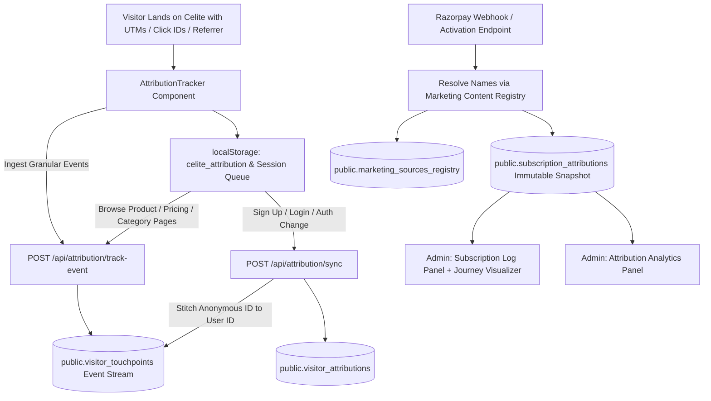

---
agent-notes:
  ctx: "Complete architectural and implementation documentation for Universal Marketing Attribution & Customer Journey Tracking system"
  deps: ["lib/attribution.ts", "components/AttributionTracker.tsx", "supabase_migrations/52_universal_marketing_attribution.sql", "app/api/attribution/track-event/route.ts", "app/api/admin/analytics/attribution/route.ts", "app/admin/components/MarketingSourcesRegistryPanel.tsx"]
  state: active
  last: "sato@2026-08-16"
---

# Universal Marketing Attribution & Customer Journey Tracking System Documentation

## 1. Overview & Objective
The **Universal Marketing Attribution & Customer Journey Tracking** system answers the central business question:
> **"For every subscription, determine where the customer came from, what they interacted with, how they moved through Celite, which source eventually converted them, and how much revenue each source/content/campaign generated."**

The system operates across all channels:
- Instagram Paid / Organic
- Facebook Paid / Organic
- YouTube Organic / Paid
- Google Organic / Ads
- Search Engines (Bing, Yahoo, DuckDuckGo)
- AI Assistants (ChatGPT, Claude, Perplexity)
- Referral Websites
- WhatsApp & Email
- Direct (Disambiguated: Genuine Direct vs Returning Attributed Direct vs Unknown/Referrer Missing)
- Unknown / Unattributed (Strict zero-guessing policy)

---

## 2. End-to-End Architecture & Data Flow

---

## 3. Database Schema (Migration 52)

1. **`marketing_sources_registry`**:
   - Internal registry table mapping platform identifiers (`campaign_id`, `adset_id`, `ad_or_video_id`, `content_id`) to friendly display names (`campaign_name`, `ad_or_video_name`, etc.), destination URLs, and product associations.
2. **`visitor_touchpoints`**:
   - Append-only chronological event stream recording `landing`, `homepage`, `category_view`, `product_view`, `pricing_view`, `checkout_started`, `payment_started`, `subscription_created`.
3. **`visitor_attributions`**:
   - User marketing profile maintaining permanent first-touch origin, updated last-touch, touch count, session count, and confidence level.
4. **`subscription_attributions`**:
   - Permanent immutable snapshot created at the instant of subscription purchase, supporting audit-trailed manual corrections (`is_manually_corrected`, `corrected_by`, `correction_reason`, `original_attribution`).

---

## 4. Key Capabilities & Analytics Reports

1. **First-Touch vs Last-Touch Comparison**:
   - Compares discovery channel revenue against immediate converting channel revenue.
2. **Assisted Conversions Matrix**:
   - Visualizes multi-touch paths (e.g. `Instagram Paid → Google Organic → Direct → Subscription`).
3. **Marketing Content Registry & Campaign Drilldown**:
   - Resolves raw Meta Ad IDs and YouTube Video IDs into human-readable titles across all analytics and customer journey timelines.
4. **Direct & Unknown Traffic Disambiguation**:
   - Separates **Genuine Direct** from **Direct (Previously Attributed)** and **Unknown / Referrer Missing** without guessing.
5. **Interactive Customer Journey Timeline Visualizer**:
   - Vertical chronological timeline in Subscription Log showing every touchpoint and milestone from discovery to payment.
6. **Manual Attribution Correction**:
   - Audit-logged admin correction interface preserving original tracking data.
7. **CSV Export**:
   - Export full multi-touch dataset directly from the admin panel.
