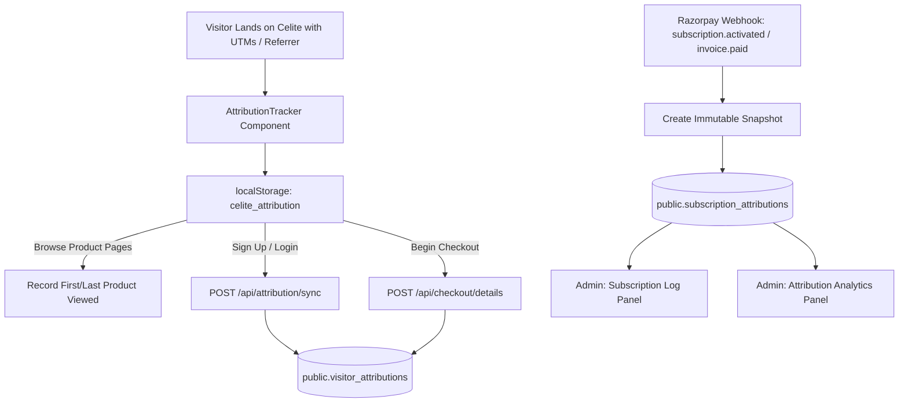

---
agent-notes:
  ctx: "Complete architectural and implementation documentation for Subscription Attribution & Analytics system"
  deps: ["lib/attribution.ts", "components/AttributionTracker.tsx", "app/api/attribution/sync/route.ts", "app/api/admin/analytics/attribution/route.ts"]
  state: active
  last: "sato@2026-08-14"
---

# Subscription Attribution & Analytics System Documentation

## 1. Overview & Objective
The **Subscription Attribution & Analytics** feature answers the central business and marketing question:
> **"Where did this paying customer come from, and which campaign/source drove the subscription?"**

It provides a 100% database-backed, financial-grade attribution system that tracks:
- **First-Touch Discovery**: Where the customer originally found Celite (e.g. an Instagram Ad or YouTube video).
- **Last-Touch Conversion**: Which channel or visit directly preceded the subscription payment (e.g. returning via Google Organic or Direct).
- **Assisted Conversions**: Quantifying multi-touch journeys where paid ads generated initial discovery, even if the final conversion happened directly.

---

## 2. End-to-End Architecture & Data Flow

### Step 1: Client-Side Touchpoint Capture
- When any visitor navigates to Celite, [`components/AttributionTracker.tsx`](file:///d:/celite-main/celite-main/components/AttributionTracker.tsx) invokes [`lib/attribution.ts`](file:///d:/celite-main/celite-main/lib/attribution.ts).
- It extracts `utm_source`, `utm_medium`, `utm_campaign`, `utm_content`, `utm_term`, `gclid`, `fbclid`, `document.referrer`, and landing page.
- Strips any sensitive parameters (`password`, `token`, `key`, `secret`, `auth`).
- Persists to `localStorage` under `celite_attribution` along with an anonymous visitor ID.
- First-touch attributes are **immutable**. When a user returns via a new campaign or external site, only last-touch attributes update.

### Step 2: Anonymous to Authenticated Identity Stitching
- When the visitor registers, logs in, or enters checkout details:
  - Dispatches `POST /api/attribution/sync` with their Supabase bearer token.
  - Or sends `attribution` payload with `POST /api/checkout/details`.
  - The server records or updates [`public.visitor_attributions`](file:///d:/celite-main/celite-main/supabase_migrations/51_add_attribution_tables.sql).

### Step 3: Immutable Financial Snapshot on Payment
- When Razorpay fires a payment success event (`subscription.activated`, `invoice.paid`, or `invoice.payment_succeeded`):
  - [`app/api/razorpay/webhook/route.ts`](file:///d:/celite-main/celite-main/app/api/razorpay/webhook/route.ts) reads the user's `visitor_attributions` record.
  - It creates an **immutable snapshot row** in [`public.subscription_attributions`](file:///d:/celite-main/celite-main/supabase_migrations/51_add_attribution_tables.sql) tied to `checkout_detail_id` and `user_id`.
  - Future visits by the user will never overwrite historical purchase attribution.

---

## 3. Standardized Attribution Source Classification

[`lib/attribution.ts`](file:///d:/celite-main/celite-main/lib/attribution.ts) normalizes traffic into **11 human-readable channels** based on strict hierarchy:

| Source Name | Detection Logic |
|-------------|-----------------|
| **Instagram Paid** | `utm_source=instagram` with `utm_medium` matching `paid_social`, `cpc`, `ads`, `display`, `sponsor`, or `meta` |
| **Instagram Organic** | `utm_source=instagram` or referrer from `instagram.com` / `l.instagram.com` |
| **Facebook Paid** | `utm_source=facebook` with paid medium or `fbclid` with ads |
| **Facebook Organic** | `utm_source=facebook` or referrer from `facebook.com` / `fb.me` |
| **Google Ads** | `utm_source=google` with `utm_medium=cpc|ads` or presence of `gclid` |
| **Google Organic** | `utm_source=google` or referrer from `google.*` |
| **YouTube** | `utm_source=youtube` or referrer from `youtube.com` / `youtu.be` |
| **ChatGPT / AI** | Source or referrer from `chatgpt.com`, `openai.com`, `claude.ai`, `anthropic`, `perplexity.ai` |
| **Referral** | Any external non-Celite referring domain |
| **Direct** | Direct navigation without UTMs and without external referrer |
| **Other** | Custom or unclassified source parameters |

---

## 4. File-by-File Summary of Changes

### Database & Migrations
1. **[`supabase_migrations/51_add_attribution_tables.sql`](file:///d:/celite-main/celite-main/supabase_migrations/51_add_attribution_tables.sql)**:
   - Created `visitor_attributions` (user marketing journey).
   - Created `subscription_attributions` (immutable subscription purchase snapshot).
   - Enabled RLS with admin access policies and foreign keys.

### Core Libraries & Utilities
2. **[`lib/attribution.ts`](file:///d:/celite-main/celite-main/lib/attribution.ts)**:
   - Source normalization algorithm.
   - URL sanitization & parameter stripping.
   - `localStorage` safe accessor methods (`getStoredAttribution`, `setStoredAttribution`, `captureAttribution`, `recordProductView`).

### Frontend Components
3. **[`components/AttributionTracker.tsx`](file:///d:/celite-main/celite-main/components/AttributionTracker.tsx)**:
   - Listens to Next.js route & search parameter changes.
   - Records product page views (`/product/[slug]`).
   - Syncs anonymous attribution to authenticated user on auth state change.
4. **[`app/layout.tsx`](file:///d:/celite-main/celite-main/app/layout.tsx)**:
   - Mounted `<AttributionTracker />` inside `<Suspense>` within `<AppProvider>`.
5. **[`app/checkout/page.tsx`](file:///d:/celite-main/celite-main/app/checkout/page.tsx)**:
   - Attached client attribution data when initializing checkout details.

### API Routes & Webhooks
6. **[`app/api/attribution/sync/route.ts`](file:///d:/celite-main/celite-main/app/api/attribution/sync/route.ts)**:
   - Upserts `visitor_attributions` for authenticated users.
7. **[`app/api/checkout/details/route.ts`](file:///d:/celite-main/celite-main/app/api/checkout/details/route.ts)**:
   - Handles attribution payload on checkout initialization.
8. **[`app/api/razorpay/webhook/route.ts`](file:///d:/celite-main/celite-main/app/api/razorpay/webhook/route.ts)**:
   - Stamps immutable attribution snapshot into `subscription_attributions` upon payment completion.
9. **[`app/api/subscription/activate/route.ts`](file:///d:/celite-main/celite-main/app/api/subscription/activate/route.ts)**:
   - Fallback attribution snapshot recorder for instant client-side activations.
10. **[`app/api/admin/checkout-logs/route.ts`](file:///d:/celite-main/celite-main/app/api/admin/checkout-logs/route.ts)**:
    - Enriched checkout log response with attribution snapshots.
11. **[`app/api/admin/analytics/attribution/route.ts`](file:///d:/celite-main/celite-main/app/api/admin/analytics/attribution/route.ts)**:
    - Aggregates attribution data: total revenue, MRR/ARR, AOV, first/last touch source ROI, campaign ROI, product ranking, and assisted conversions.

### Admin Dashboard UI
12. **[`app/admin/components/SubscriptionLogPanel.tsx`](file:///d:/celite-main/celite-main/app/admin/components/SubscriptionLogPanel.tsx)**:
    - First-Touch and Last-Touch colored source badges.
    - Campaign and product tags.
    - Customer journey modal popup (`Discovery ➔ Conversion`) with full UTM breakdown.
    - Source filtering dropdown.
13. **[`app/admin/components/AttributionAnalyticsPanel.tsx`](file:///d:/celite-main/celite-main/app/admin/components/AttributionAnalyticsPanel.tsx)**:
    - KPI cards (Total subscriptions, Attributed revenue, AOV, Instagram Paid share, Assisted conversion rate).
    - First-Touch vs Last-Touch view mode toggle.
    - Revenue by source bar chart & customer share pie chart.
    - Detailed source breakdown table.
    - UTM Campaign performance table.
    - First product viewed ranking.
    - Assisted conversion journeys table.
    - CSV Export functionality.
14. **[`app/admin/AdminClient.tsx`](file:///d:/celite-main/celite-main/app/admin/AdminClient.tsx)** & **[`app/admin/components/AdminSidebar.tsx`](file:///d:/celite-main/celite-main/app/admin/components/AdminSidebar.tsx)**:
    - Registered `🎯 Attribution Analytics` tab in navigation.

### Architecture Records & Automated Tests
15. **[`docs/adrs/0005-subscription-attribution-system.md`](file:///d:/celite-main/celite-main/docs/adrs/0005-subscription-attribution-system.md)**:
    - Architecture Decision Record.
16. **[`docs/tracking/2026-08-14-subscription-attribution-plan.md`](file:///d:/celite-main/celite-main/docs/tracking/2026-08-14-subscription-attribution-plan.md)**:
    - Implementation tracking record.
17. **[`__tests__/attribution.test.ts`](file:///d:/celite-main/celite-main/__tests__/attribution.test.ts)**:
    - 10 unit tests for source normalization, URL sanitization, and touchpoint immutability.
18. **[`__tests__/attribution-analytics.test.ts`](file:///d:/celite-main/celite-main/__tests__/attribution-analytics.test.ts)**:
    - Integration test for admin analytics aggregation calculations.
